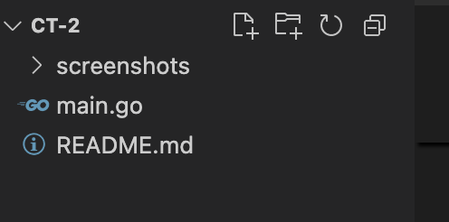
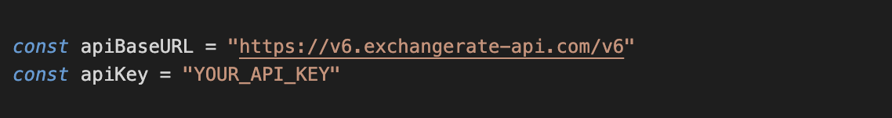
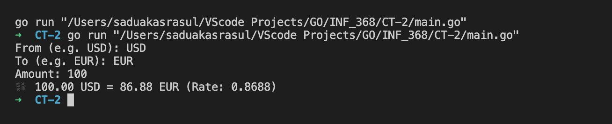

# Currency Converter CLI (Golang)

This is a simple command-line currency converter written in Go using the [ExchangeRate API](https://www.exchangerate-api.com/).

## 📦 Features

- Converts any amount from one currency to another.
- Fetches real-time exchange rates using public API.
- Simple CLI interface.

## 🚀 Getting Started

### Prerequisites

- Go 1.18+
- ExchangeRate API key (register at https://www.exchangerate-api.com/)

###  Project Structure

### Insert Your API Key

### Usage 

